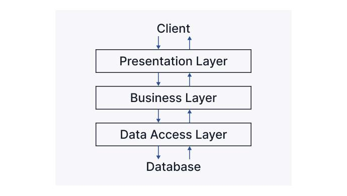

# goit-pythonweb-hw-10

В даному проекті реалізовано REST API додаток з використанням багаторівневої
архітектури 

## Стек

- Python 3.11
- FastAPI
- PostgreSQL
- ORM SQLAlchemy
- Alembic
- Swagger
- Pydantic
- Docker
- Poetry
- JWT
- Gravatar
- Dotenv
- Slowapi
- Cloudinary

## Технічнe завдання

1. Реалізуйте механізм аутентифікації в застосунку.
2. Реалізуйте механізм авторизації за допомогою JWT-токенів, щоб усі операції з
   контактами проводились лише зареєстрованими користувачами.
3. Користувач повинен мати доступ лише до своїх операцій з контактами.
4. Реалізуйте механізм верифікації електронної пошти зареєстрованого
   користувача.
5. Обмежте кількість запитів до маршруту користувача /me.
6. Увімкніть CORS для свого REST API.
7. Реалізуйте можливість оновлення аватара користувача (використовуйте сервіс
   Cloudinary).

## Інсталяція та запуск

1. Склонуйте репозиторій

2. Перейдіть в директорію проекта

```
cd goit-pythonweb-hw-10
```

3. Створіть та налаштуйте `.env` файл у корені проєкту за прикладом:

```
JWT_SECRET=<your jwt secret>

DB_NAME=contacts_db
DB_USER=postgres
DB_PASSWORD=<your db password>
DB_PORT=5432
DB_HOST=<host>
DB_URL=postgresql+asyncpg://${DB_USER}:${DB_PASSWORD}@${DB_HOST}:${DB_PORT}/${DB_NAME}

CLD_NAME=<your cloudinary name>
CLD_API_KEY=<your cloudinary API key>
CLD_API_SECRET=<your cloudinary API secret>
```

4. Використайте Docker Compose для побудови і запуску середовища.

```
docker-compose up --build
```

5. Веб-додаток працює на порту 8000:

Swagger: http://localhost:8000/docs


